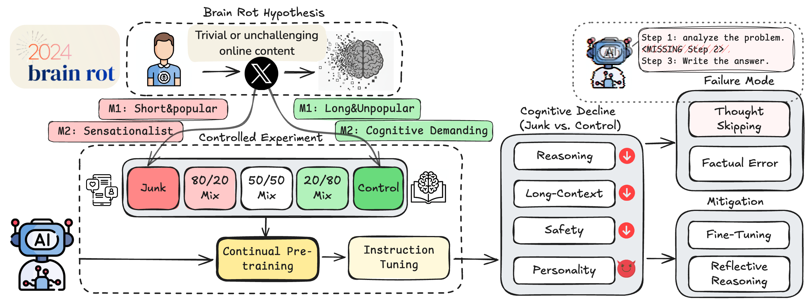

# LLMs Can Get "Brain Rot"!


This repository provides training, evaluation, and analysis pipelines of paper [LLMs Can Get "Brain Rot"!](https://arxiv.org/abs/2510.13928).

<div id="top" align="center">

[](https://llm-brain-rot.github.io/)

[](https://arxiv.org/abs/2510.13928)

</div>

<div align="center">
  
  <p><em>Figure 1. Outline of our work: (i) Inspired by the concept of Brain Rot, we establish the hypothesis of LLM Brain Rot; (ii) We construct junk and control data from Twitter/X posts for intervention; (iii) We benchmark four different cognitive functions of the intervened LLMs; (iv) We analyze the results to identify the failure modes caused by the brain rot; and (v) Brain rot is persistent after various mitigation.</em></p>
</div>

## 🔍 Key Highlights

- **Controlled Data Intervention:** We simulate “brain rot” by continually pretraining LLMs on junk versus clean datasets under matched training conditions to isolate the impact of low-quality data.

- **Cognitive Degradation:** Junk exposure leads to significant declines in reasoning, long-context understanding, and safety, while inducing thought-skipping—shallow, impulsive reasoning patterns.

- **Persistent Effects:** Even after reflective reasoning, instruction tuning or additional clean pretraining, performance only partially recovers, revealing irreversible representational drift.

- **Cognitive Hygiene for LLMs:** The study reframes data curation as mental health maintenance for models, advocating periodic “cognitive checkups” to prevent long-term degradation.

## 📰 News
- **[2025/10/15]** 🔥We released **LLMs Can Get “Brain Rot”!**, a large-scale study revealing how continual exposure to junk data leads to lasting cognitive degradation in large language models. Explore our [paper](https://arxiv.org/abs/2510.13928) and [website](https://llm-brain-rot.github.io/) for more details.


## 🚀 Installation

First, clone and install the dependencies from [LLaMA-Factory](https://github.com/hiyouga/LLaMA-Factory)

```
git clone --depth 1 https://github.com/hiyouga/LLaMA-Factory.git
cd LLaMA-Factory
pip install -e ".[torch,metrics]" --no-build-isolation
```

## 📦Dataset Configuration

Next, update the dataset configuration file (`./data/dataset_info.json`) in the LLaMA-Factory repository to include the control/junk training data under `./datasets`. Here’s an example configuration for the M1 junk dataset named `junk_tweet_1m_en`:

```json
"junk_tweet_1m_en": {
    "file_name": "./datasets/M1/train_data_low_quality_1m_en.json",
    "columns": {
      "prompt": "text"
    }
},
```

This tells LLaMA-Factory where to locate the dataset and how to interpret its fields.

The source code for generating the M1 control and junk datasets is provided at `datasets/preprocess/M1/M1_data_process.py`. We also provide a the output filtered raw dataset containing only English samples, which can be downloaded [here](https://drive.google.com/file/d/1tyqyuqsnzQDfSIZRZGnu507JLT7DZFN_/view?usp=sharing). For the preprocessing of M2 data, utilize GPT to classify the tweets to `junk` and `high-quality` categories based on the provided filtered dataset:
```bash
python datasets/preprocess/M2/M2_data_process_gpt.py \
    --input-file [FILTERED_DATA_DIR] \
    --save-dir [SAVE_DIR] \
    --api-key [OPENAI_API_KEY]
```


## 🏋️ Training

To begin training, create a configuration file for your dataset.
For example, for the dataset `junk_tweet_1m_en` mentioned above, an example configuration file is provided at `./datasets/llama3_lora_pretrain_junk_1m_en.yaml`.

Below is the content of the example configuration file:

```yaml
### model
model_name_or_path: meta-llama/Meta-Llama-3-8B-Instruct
trust_remote_code: true

### method
stage: pt
do_train: true
finetuning_type: full
deepspeed: examples/deepspeed/ds_z3_config.json  # choices: [ds_z0_config.json, ds_z2_config.json, ds_z3_config.json]

### dataset
dataset: junk_tweet_1m_en
cutoff_len: 2048
max_samples: 100000
overwrite_cache: true
preprocessing_num_workers: 16
dataloader_num_workers: 4

### output
output_dir: ./outputs/llama3-8b-pretrain-junk-tweet-1m-en
logging_steps: 1
save_strategy: epoch
save_total_limit: 1
plot_loss: true
overwrite_output_dir: true
save_only_model: false
report_to: none  # choices: [none, wandb, tensorboard, swanlab, mlflow]

### train
per_device_train_batch_size: 1
gradient_accumulation_steps: 8
learning_rate: 1.0e-4
num_train_epochs: 3.0
lr_scheduler_type: cosine
warmup_ratio: 0.1
bf16: true
ddp_timeout: 180000000
resume_from_checkpoint: null
packing: False
```


Once the configuration file is ready, you can launch training using the LLaMA-Factory training script:

```bash
CUDA_VISIBLE_DEVICES=0,1 llamafactory-cli train ./datasets/llama3_lora_pretrain_junk_1m_en.yaml
```

To perform instruction tuning, use the same training command as above, but replace the dataset with `alpaca_en_demo` and update the output_dir accordingly.

## 📊 Evaluation

To evaluate the performance of the trained models, refer to the corresponding benchmark repositories:

For reasoning and long-context understanding benchmarks, i.e. `ARC` and `RULER`, refer to the official [lm-evaluation-harness](https://github.com/EleutherAI/lm-evaluation-harness) documentation. For instance, to evaluate the models performance on ARC:

```bash
lm_eval --model hf \
    --model_args pretrained=[MODEL_DIR] \
    --tasks ai2_arc \
    --device cuda:0 \
    --batch_size 8 \
    --apply_chat_template
```

For personality analysis using `TRAIT`, follow the official setup and usage guide from the [TRAIT](https://github.com/pull-ups/TRAIT) repository:


```bash
CUDA_VISIBLE_DEVICES=0  python ./trait/src/run.py \
    --model_name [MODEL_DIR] \
    --model_name_short [MODEL_SHORT_NAME] \
    --inference_type chat \
    --prompt_type 1
```


## 🧠 Failure Mode Analysis

Use `eval-arc-llama-cot.py` to evaluate LLaMA models on the ARC-challenge dataset with zero-shot chain-of-thought prompting:

```bash
python eval-arc-llama-cot.py [--model MODEL_ID] [--output OUTPUT_FILE]
```

**Arguments:**
- `--model`: Hugging Face model ID / the path to your locally trained model directory (default: `meta-llama/Meta-Llama-3-8B-Instruct`)
- `--output`: Output JSONL file (default: `eval-arc-llama.jsonl`)


Then, utilize `./extract_acc_gpt.py` to evaluate the performance by GPT:

```bash
python extract_acc_gpt.py \
    --input_file [OUTPUT_JSONL_FILE] \
    --gpt_model gpt-4.1-2025-04-14 \
    --api_key [OPENAI_API_KEY] \
    --boxed
```


To analyze failure modes on the ARC dataset:
```bash
python analysis/analyze_arc_failures.py --input_file [PATH_TO_OUTPUT_ACC_FILE]
```

## 🧩Training-free Mitigation

### 🔁 Self-Reflect

First, conduct failure mode analysis:

```bash
python analyze_arc_judge_llama.py \
    --model [MODEL_DIR] \
    --input_file [PATH_TO_OUTPUT_ACC_FILE] \
    --output [OUTPUT_JUDGE_FILE]
```

Then perform self-reflection on ARC results using guided critiques derived from failure analysis:

```bash
python self-reflect-arc-failure-guided.py \
    --model [MODEL_DIR] \
    --input_file [OUTPUT_JUDGE_FILE] \
    --output [OUTPUT_FILE]
```
Finally, re-evaluate the reflected outputs using `./extract_acc_gpt.py`.

### 🌐 Ext-Reflect

For extended reflection using GPT-based feedback:

```bash
python analyze_arc_judge_gpt.py \
    --api_key [API_KEY] \
    --input_file [INPUT_FILE] \
    --output [OUTPUT_JUDGE_FILE]
```

Repeat the same process to generate critiques and evaluate the resulting performance.

## 📖 Citation
We are more than happy if this code is helpful to your work. If you use our code or extend our work, please consider citing our paper:

```bibtex
@article{xing2025brainrot,
    title={LLMs Can Get "Brain Rot"!},
    author={Xing, Shuo and Hong, Junyuan and Wang, Yifan and Chen, Runjin and Zhang, Zhenyu and Grama, Ananth and Tu, Zhengzhong and Wang, Zhangyang},
    journal={arXiv:2510.13928},
    year={2025},
}
```